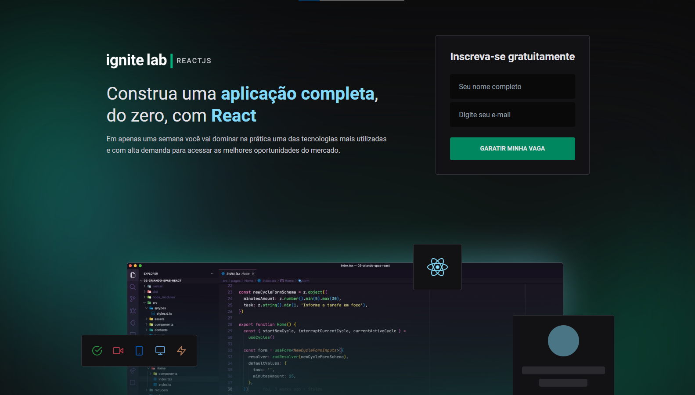

# 💻 Ignite Labs - Rocketseat

<h4 align="center"><a href="https://bootcamps-eight.vercel.app/">Clique para ver o site</a></h4>
<h4 align="center"><a href="https://www.figma.com/file/7HTeS7QpZAZxJd3PyUZISU/Plataforma-de-evento---Ignite-Lab?node-id=0%3A1">Clique para ver o projeto Figma</a></h4>

---

## 📚 Seções

O site consiste em três seções principais:

- **Home:** Página onde é possível realizar um cadastro de usuário;
- **Event:** Página onde é possível ver o evento e assisitir uma determinada aula;
- **Lesson:** Menu lateral para acessar as aulas cadastradas;

---

## 🛠️ Desenvolvido com

O site foi desenvolvido usando as tecnologias:

 

 

 

---

## ⚙️ Descrição

O projeto é simples, feito para conhecer treinar o uso das ferramentas mencionadas anteriormente
Nesse site o usuário pode se cadastrar e assistir as aulas criadas via GraphCMS

---

## ✒️ Autor

| [ Felipe Ferreira](https://github.com/FelipeFerreiraDev)
| :---: |

---

Obrigado por me ceder seu tempo lendo sobre o meu trabalho.

Qualquer dúvida, crítica ou sugestão entre em <a href="mailto:felipeferreira.sp.dev@gmail.com/">contato</a> pelo meu e-mail